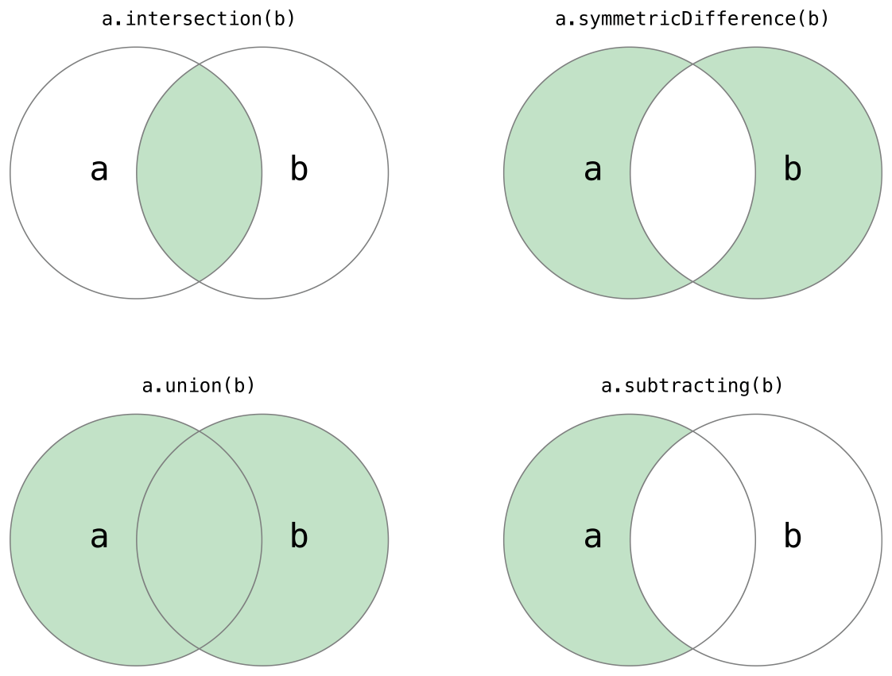

## 배열 (Array)

데이터 타입의 값들을 순서대로 저장하는 리스트.

### 배열의 축약형 문법
```swift
var someInts = [Int]()
print("someInts type with \(someInts.count) items.")
// someInts type with 0 items.
```

```swift
someInts.append(3)
// 배열에 3을 추가하는 방법
someInts = []
// 배열을 초기화하는 방
```

<br>

### 리터럴을 이용한 배열의 생성

`[value 1, value 2, value 3, ...]` 형태로 배열을 생성할 수 있다.

```swift
var shoppingList [String] = ["Eggs"], ["water"]

// 아래와같이 더 간단하게 설정할 수 있다.
var shoppingList = ["Eggs"], ["water"]  
```

<br>

### 배열이 비어있는지 확인
```swift
if shoppingList.isEmpty {
    print("The shoppingList is empty")
} else {
    print("The shoppingList is not empty")
}
// The shoppingList is not empty
```

<br>

### 배열에 원소 추가
```swift
shoppingList.append("milk")
// shoppingList.count = 3
```

<br>

### 배열의 특정 위치에 있는 원소에 접근
```swift
shoppingList[0]
// shoppingList[0] = "Eggs"

shoppingList[0..2]
// shoppingList[0..2] = "Eggs", "water"
// [0..2]는 0부터 2의 앞에까지 이므로, 0과 1번만 출력
```

<br>

## 셋 (Set)

같은 데이터 타입의 값을 순서없이 저장하는 리스트

### 빈 Set 생성

```swift
var letters = Set<Character>()
print("letters is \(letters) items.
// letters is 0 items.
```

<br>

### 배열 리터럴을 이용한 Set 생성
```swift
var favoriteGenres: Set<String> = ["Rock"], ["Classical"], ["Hip hop"]

// Swift의 타입추론으로 아래와 같은 방법으로도 선언 가능
var favoriteGenres: Set = ["Rock"], ["Classical"], ["Hip hop"]
```

<br>

### Set 명령


```swift
let oddDigits: Set = [1, 3, 5, 7, 9]
let evenDigits: Set = [0, 2, 4, 6, 8]
let singleDigitPrimeNumbers: Set = [2, 3, 5, 7]

oddDigits.union(evenDigits).sorted()
// [0, 1, 2, 3, 4, 5, 6, 7, 8, 9]
oddDigits.intersection(evenDigits).sorted()
// []
oddDigits.subtracting(singleDigitPrimeNumbers).sorted()
// [1, 9]
oddDigits.symmetricDifference(singleDigitPrimeNumbers).sorted()
// [1, 2, 9]
```

<br>

## 사전 (Dictionaries)

순서없기 키(Key)와 값(Value) 한 쌍으로 데이터를 저장하는 컬렉션 타입.

[Key : Value]형태

```swift
var namesOfIntegers = [Int: String]()

nameOfIntegers = [:]
```

<br>

### 리터럴을 이용한 Dictionary의 생성

`[Key 1: value 1, Key2 : value2, Key3 : value3]` 형태로 사전을 선언할 수 있다.

```swift
var airport: [String: String] = ["YYZ": "Toronto Pearson", "DUB": "Dublin"]
```